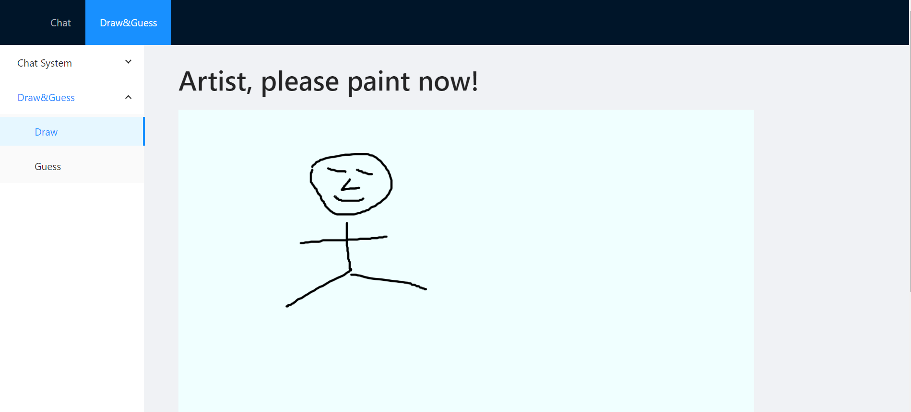
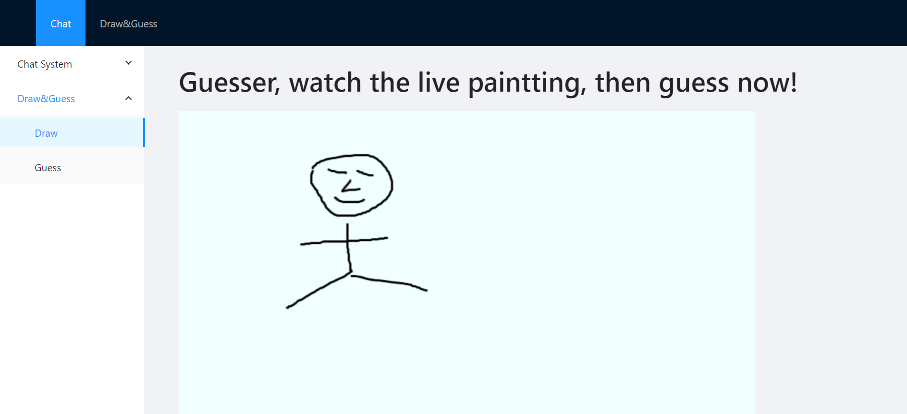

# draw and guess
based on django_channels_chat_official_tutorial_react project,
create draw and guess game feature.

# demo
draw page: when you are painting on this page



guess page: guesser can watch the drawing lively.



# reference
## react-sketch2
https://www.npmjs.com/package/react-sketch2

## django channels
https://channels.readthedocs.io/en/stable/tutorial/index.html


# RUN

## frontend build

```
npm run build
```

## frontend development(optional)

```
npm start
```


## start redis server

```
pip3 install -U channels_redis

docker run -p 6379:6379 -d redis:5
```

## start dev server
```
pip3 install -U channels

cd backend

python3 manage.py runserver
```

## access chat page
go to chrome, access the following URL:
http://127.0.0.1:8000/chat/

enter lobby, then click Enter to go to room page

## on chat room page
http://127.0.0.1:8000/chat/lobby/


