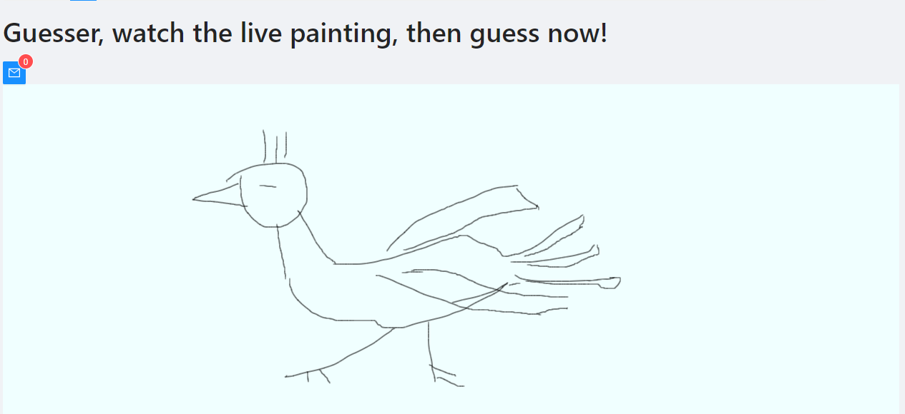

# draw and guess
based on django_channels_chat_official_tutorial_react project,
create draw and guess game feature.

# requirements

## basics
- [x] draw page, for artist, provide a sketch pad for artist to draw
- [x] guess page, for gusser, display drawing at real time for gusser

## authentication
- [x] display logging pannel if not logged by user, then user can login
- [x] display loggout pannel if logged by user, then user can logout

## gallery
- [x] display all drawings.

## comments
- [ ] every user can give comment on every drawing.


# Technology Stack

| Category | Name | Description |
| ----------- | ----------- | ----------- |
| Backend | Django | web framework |
| Backend | DRF | web framework of RESTAPI |
| Backend | Channels | websocket server library |
| Backend | djoser | authentication library based on DRF |
| Frontend | React | frontend library |
| Frontend | AntDesign | frontend UI library |
| Frontend | react-sketch2 | Canvas Drawing UI library |

# demo
draw page: when you are painting on this page


guess page: guesser can watch the drawing lively.



gallery page: disaply all drawings saved on server db.


# reference
## react-sketch2
https://www.npmjs.com/package/react-sketch2

## django channels
https://channels.readthedocs.io/en/stable/tutorial/index.html


# INSTALL

## prerequiste
| software | version |
|----------|---------|
| python3  | 3.6.8  |
| pipenv   |  2020.11.15 |
| nodejs   | v14.17.0 |
| yarn     | 1.22.10 |
| docker   | 20.10.2 |


## install dependency of frontend and backend
```
./bin/install.sh
```

# BUILD

```
./bin/build.sh
```

# RUN

## start react dev server

```
./bin/start_react.sh
```


## start django server
```
./bin/start_django.sh
```

## access page
go to chrome, access the following URL:
http://127.0.0.1:8000/

enter draw page

then open another chrome window, access URL
http://127.0.0.1:8000/

enter guess page

finally, keep two page visible, then draw and guess.


# Dev

## DB migrate

```
pipenv run python3 manage.py  migrate
```


